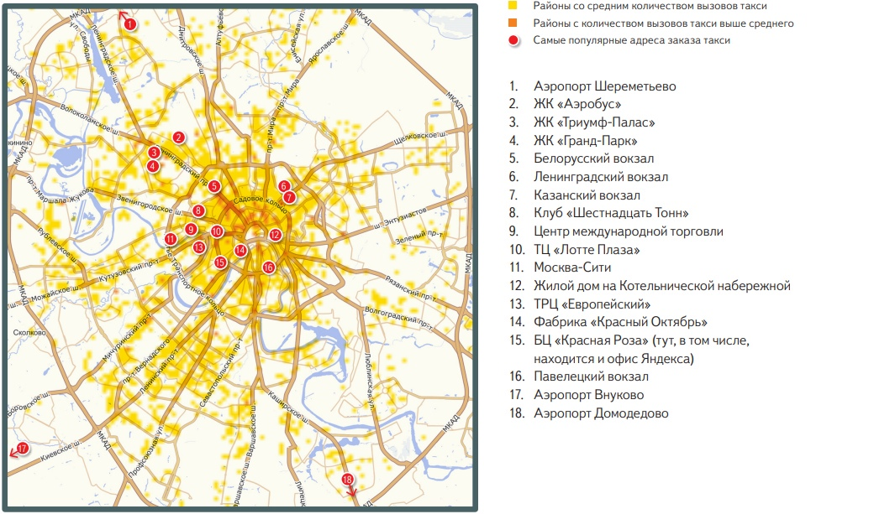
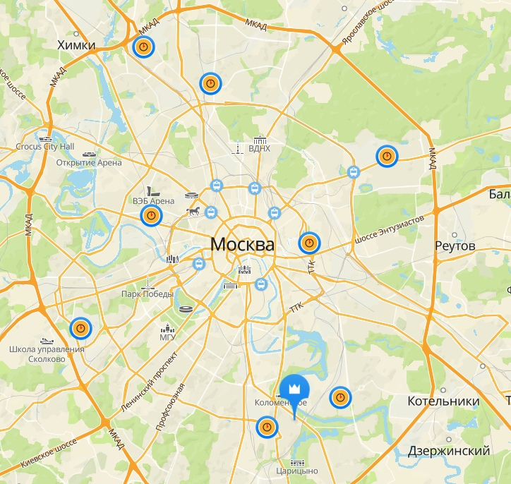

# Transport problem (Optimization course project MIPT 2020)

The project considers a common example of a linear programming problem - a transport problem. My task was to automate the process of solving the problem (the Monge — Kantorovich formulation) by the method of potentials using python tools and compare them with the results of the simplex method (scipy.optimize.linprog).

# Files

> [Code.ipynb](https://github.com/EjenY-Poltavchiny/Transport-problem/blob/main/Python_code.ipynb)

Python implementation of the method of potentials. As the first test data, the data of the solved problem from the lectures of our course were taken. I have compared the operating time of the potential method and the simplex method. 

**I used the data collected according to** 

* statistics of taxis in Moscow:

* locations of the taxi pool"Taxi Rhythm" company:
 

* number of departure and destination points is taken according to the arrival schedule of trains/planes and statistics of taxi orders
----------------------------------------

> [Project_title.pdf](https://github.com/EjenY-Poltavchiny/Transport-problem/blob/main/Project_title.pdf)

The formulation of the transport problem is described here. Some calculations of the reduction of the transport problem to the canonical form of the linear programming problem. You can also find a pseudocode of methods for finding the extreme point and the method of potentials.

# Authors 

Poltavtsev Evgeniy

Merkulov Daniil

> I will be glad to have a star if it was useful :wink:

# Enviroment

Jupyter notebook

